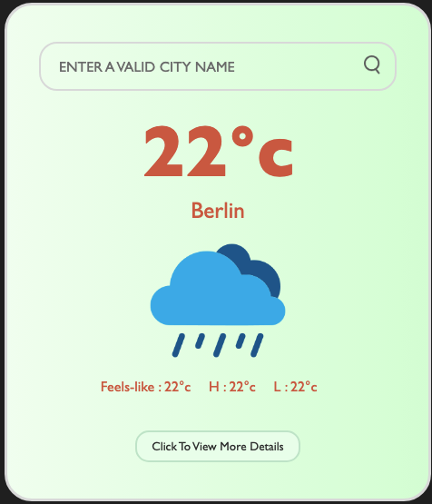
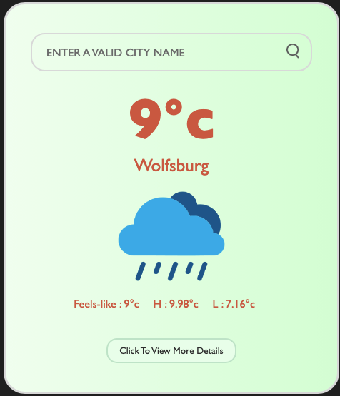
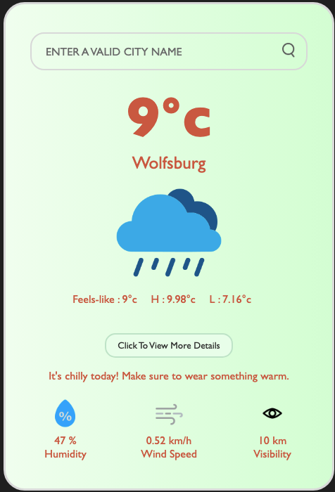
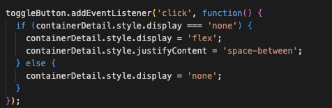
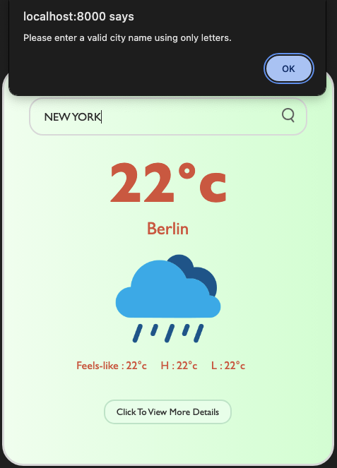
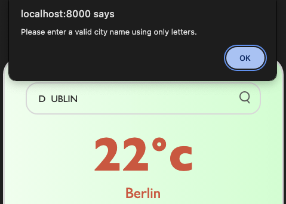
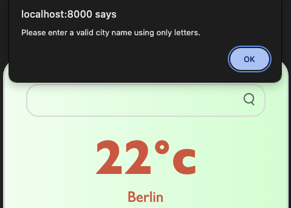
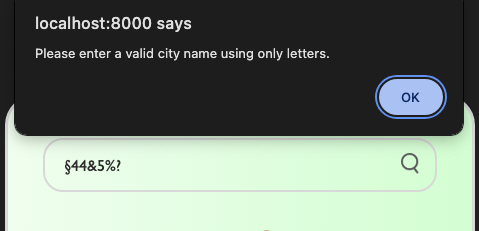
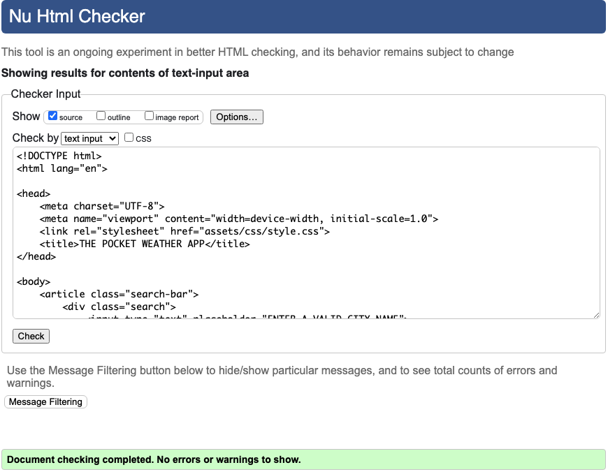
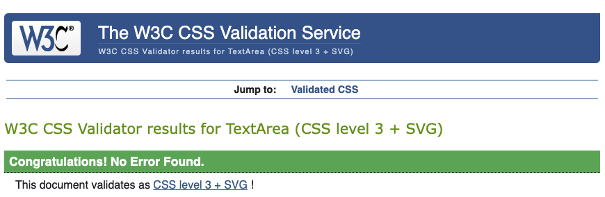

# Purpose

- **Problem Statement:** Many existing weather apps can feel overwhelming, bombarding users with excessive data points or complex visuals.  Finding the basics – the current temperature and what the weather means for your outfit choices – can be more difficult than it should be. This leaves a need for a fun and truly simple weather app that cuts to the chase, focusing on the information that matters most for daily decision making.

- **Solution:** This project delivers a refreshingly simple and straightforward weather app.  At its core, it provides the current temperature and relevant inforamtion such as highest and lowest temperatures, wind speed and visibility for the user's location. The unique value lies in the app's focus on  practicality. It goes beyond just the numbers, offering simple outfit recommendations to help users quickly decide what to wear based on the day's forecast.

- **Key Objectives:**

   * **Efficiency:** Streamline the process of getting weather information and outfit recommendations, making it quick and enjoyable for users.  The focus is on delivering essentials without unnecessary complexity.
   * **Discovery:** Enable users to explore weather conditions around the world with ease. Whether it's planning for a trip or simply satisfying curiosity, the app facilitates the discovery of weather in various locations.

# UX Design

The weather app prioritizes a clean and intuitive interface designed to provide weather information effortlessly.

- **Minimalist Approach:** The focus is on delivering the core weather data (temperature, conditions, location) without overwhelming the user with excessive details.
- **Visual Clarity:** Weather conditions are represented using clear icons along with the usage of visual hierarchy by using bigger font sizes to emphasize the current temperature , aiding quick comprehension.
- **Outfit Recommendations:** A simple but unique UX feature is the app's ability to suggest outfits based on the forecast, adding a practical element to enhance decision-making.
- **Color Palette:** The app uses a version of light green and red color for soothing and calm look. 

# Features

## Functions Overview

The functions in this weather app work together to fetch weather data from an external API, process the response, update the user interface with the relevant information, and provide outfit suggestions based on the temperature.

- **`checkForValidity()`**
    * **Purpose:** Validates user input to ensure a proper city name is provided.
    * **Functionality:** 
        *   Checks if the city name is empty.
        *   Verifies that the city name contains only letters.
        *   Ensures the city name length doesn't exceed the allowed maximum.

- **`updateWeather()`**
    * **Purpose:** Takes the parsed weather data and updates the various UI elements on the page. 
    * **Functionality:**  
        *   Updates the city name.
        *   Displays current temperature, feels-like temperature, high, and low temperatures.
        *   Displays humidity, wind speed, and visibility.
        *   Chooses an appropriate weather icon based on the weather conditions.
        *   Clears the search input field.

- **`getWeather()`** 
    * **Purpose:**  The core function that fetches weather data from the OpenWeatherMap API.
    * **Functionality:**
        *   Calls `checkForValidity` function to ensure the city name is valid.
        *   Constructs the API URL with the city name and API key.
        *   Uses fetch to make an API request.
        *   Handles potential errors.
        *   Parses the JSON response into a JavaScript object.
        *   Calls `updateWeather` function to display the data.

- **`suggestOutfit()`**
    * **Purpose:**  Provides a simple outfit suggestion based on the current temperature.
    * **Functionality:**
        *   Extracts the temperature value from the UI.
        *   Uses a series of 'if' conditions to determine the appropriate outfit suggestion.
        *   Updates the 'outfit-suggestion' element with the suggestion.

- **`Event Listeners`**
    *   **Search Button Click:** Triggers the getWeather function when the search button is clicked.
    *   **Enter Key Press:** Triggers the getWeather function when the Enter key is pressed within the search input field.
    *   **Input Change:** Converts the text in the search input field to uppercase in real-time.
    *   **Toggle Button Click:** Toggles the visibility of the details section and outfit suggestion.

## Existing Features

- **Start Up Screen**

    

The startup screen welcomes user with a default destination and temperature. 

- **User enters a new location in the search bar and either presses 'Enter' or clicks the search button**

    

When user  gives a new location and either presses 'Enter' or clicks on the search button, the app gets updated with the
correct weather information of that location.

- **User presses 'Click to view more details' button**

    

When user presses 'Click to view more details' button, an extended version of the weather app is shown that includes a simple outfit recommendtion based on the temperature along with several other weather parameters such as humidity, wind speed and visibility.

- **OpenWeatherMap One Call API**

    - **Purpose:** The core API used to fetch current weather conditions, forecasts, and other weather-related data for locations around the world.
        * **API Key:** This is essential for authentication and using the API successfully and has been added to the top of the code.
        * **API Endpoint:** Code specifically uses the "weather" endpoint, which provides current weather data which is used to construct the API URL. 

# Technologies

## Languages

- HTML, CSS, JAVASCRIPT.

## Program, frameworks , libraries

- [Gitpod](https://gitpod.io/) IDE to develop the website.
- [GitHub](https://GitHub.com/) to host the source code.
- [GitHub Pages](https://pages.github.com/) to deploy and host the live website.
- Git to provide version control (to commit and push code to the repository). 
- [OpenWeatherMap API](https://openweathermap.org/api/one-call-api) API documentation for details on available endpoints and parameters.
- [W3C HTML Validator](https://validator.w3.org/#validate_by_input) to validate HTML code.
- [W3C CSS Validator (Jigsaw)](https://jigsaw.w3.org/css-validator/#validate_by_input) to validate HTML code.
- Code Institute's Python Template to generate the workspace for the project.

# Deployment

## Github And Github Pages
This project was created on GitHub using the Code Institute template and deployed live using GitHub Pages. The instructions to achieve this are below:

1. Log in (or sign up) to Github.
2. Find the repository for this project, mushroom_stories.
3. Click on the Settings link.
4. Click on the Pages link in the left hand side navigation bar.
5. In the Source section, choose main from the drop down select branch menu. Select Root from the drop down select folder menu.
6. Click Save. Your live Github Pages site is now deployed at the URL shown. 

## Version Control
Git was used for version control. Changes were committed to the main branch of the GitHub repository. 
The following commands were used throughout the project:

1. git add . - new (or untracked), deleted and modified files are added to Git staging area.
2. git commit -m "commit message" - to commit changes to the local repository.
3. git push - to push all committed changes to the GitHub repository.
4. git pull - to pull the changes from the remote branch and integrate them with the current local branch.
5. git status - to display the state of the working directory and the staging area.
6. git log - to display commits.

## How To Fork
To fork the weather-app repository:

1. Log in (or sign up) to Github.
2. Go to the repository for this project, hsjoi0214/weather-app.
3. Click the Fork button in the top right corner.

## How To Clone
To clone the weather-app repository:

1. Log in (or sign up) to GitHub.
2. Go to the repository for this project, hsjoi0214/weather-app.
3. Click on the code button, select whether you would like to clone with HTTPS, SSH or GitHub CLI and copy the link shown.
4. Open the terminal in your code editor and change the current working directory to the location you want to use for the cloned directory.
5. Type 'git clone' into the terminal and then paste the link you copied in step 3. Press enter.

# Testing

Testing was performed at both the local development stage and after deployment on GitHub Pages.

### Testing Scenario 1:
when the user enters a new location for the weather, the 'click to view more detail' button should hide the information below it until the user clicks on it.
 
- **Expected Behaviour:** With a new destination entered, information below the button is hidden.

- **Initial Result:** All the information stays visible even when user enters a new destination.
     
- **Fix:** Adjusted the event listener to fix the problem.

    

- **Result After The Fix:** With every new destination entered, informtion under the button is hidden.

### Testing Scenario 2: 
Input Validation.

- **Expected Behavior:** The user should only be able to enter valid city names consisting of letters, and an error message should appear if they enter invalid input.

- **Result Before the fix:** The user when enters destination like 'New York' and 'Los Angeles' gets prompted with an error that only letters are allowed.

    

- **Fix:** The `checkForValidity(city)` function was implemented and modified to check for empty city names, non-letter characters, and excessive length. An error message (alert)  appears for invalid  input.
 
- **Result after the fix:** The weather app now guides the user by displaying error messages upon invalid city name entries. The search only proceeds with a correctly formatted city name.

    1. **User enters destination name with a 'Space' in between**

    

    2. **User enters only 'Space' as destination name**

    

    3. **User enters 'Numbers' as destination name**

    

    4. **User enters 'Special Characters' as destination name**

    

### Testing Scenario 3: 
Image Accessibility.

- **Expected Behavior:** All images should have descriptive alt text for accessibility and SEO purposes.

- **Initial Result:** All the image tags lacked an alt attribute.

- **Fix:**  The  alt attribute was added to all the  tag in the html code.

- **Result After Fix:** Screen readers can now convey the image's purpose to visually impaired users, and search engines can better understand the page's content.

## Validation Testing

Both the HTML and CSS are validated using the Validator links provided by Code Institute.

### HTML 
The only HTML page of the app is validated using the HTML validator.

- [W3C HTML Validator](https://validator.w3.org/nu/#textarea) Nu HTML Checker.

    

### CSS 
The style.css is validated using the CSS validator.

- [W3C CSS Validator(Jigsaw)](https://jigsaw.w3.org/css-validator/#validate_by_input) CSS Validation Service.

    

## Testing When Deploying On GitHub Pages

- **Expected Behaviour:** All the pages of the website opens up without any distortion and all styles are effective.

# Credits

## Media
Images used in this project:

- haze.png: https://www.flaticon.com/free-icon/fog_2930095?term=haze&page=1&position=3&origin=search&related_id=2930095
- clear01.png: https://www.iconfinder.com/weather-icons?price=free
https://www.iconfinder.com/icons/1530392/download/png/256
- clouds02.png: https://www.iconfinder.com/weather-icons?price=free
https://www.iconfinder.com/icons/2682849/download/png/256
- drizzle01.png: https://www.iconfinder.com/weather-icons?price=free
https://www.iconfinder.com/icons/1530390/download/png/256
- humidity01.png: https://www.iconfinder.com/search?q=humidity&price=free&category=weather
https://www.iconfinder.com/icons/2682807/download/png/256 
- rain01.png: https://www.iconfinder.com/search?q=rain&price=free&category=weather
https://www.iconfinder.com/icons/4102320/download/png/256
- snow01.png: https://www.iconfinder.com/search?q=snow&price=free&category=weather
https://www.iconfinder.com/icons/1530371/download/png/256
- visibility02.png: https://www.iconfinder.com/search?q=visibility&price=free&category=weather
https://www.iconfinder.com/icons/8559861/download/png/256
- wind02.png: https://www.iconfinder.com/search?q=wind+speed&price=free&category=weather
https://www.iconfinder.com/icons/2682842/download/png/256

## HTML,CSS and JAVASCRIPT related sources
- OpenWeatherMap API: https://openweathermap.org/api/
- I have also used very commonly used code snippets for weather apps like:
    *   **await fetch(`${apiUrl}${city}&appid=${apiKey}`)**
    *   **await response.json()**
- I drew inspiration from several weather app projects that i found on GitHub (https://github.com/topics/weatherapp-javascript), particularly in the areas of HTML structure and fetching data using weather API.  My project significantly expands upon these concepts with custom code and features.
- Code institute for providing template. 

# Acknowledgements

Special thanks to my mentor ' Mr. Ronan McClelland' for providing me with various materials and his valuable pointers.
